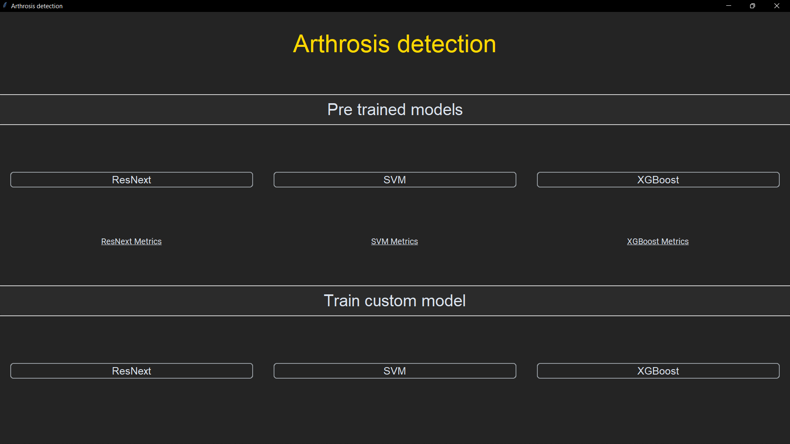

# Arthrosis Detection

Classifies an X-Ray image returning a KL (Kellen and Lawrence) level, which indicates if the provided knee has arthrosis.

### Classifiers

This software currently supports 3 different classifiers:

- ResNeXt50
- SVM
- XGBoost

## Pretrained models

You can classify knee images out of the box, using models already trained.  
For each of the three models, you see their validation metrics and a confusion matrix.

## Train custom model

You can also train a custom model, using your own dataset and setting custom values for the number of epochs (ResNext only) and the batch size.